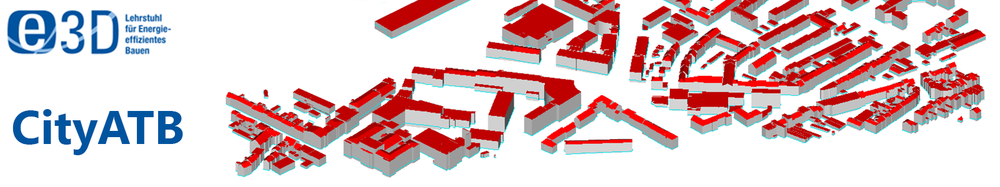

# CityATB - CityGML Analysis Toolbox 

The CityGML Analysis Toolbox (CityATB) is developed by members of the  "Institute of Energy Efficiency and Sustainable Building (e3D), RWTH Aachen University" using Python 3.5+.
This tool can be used for the analysis of CityGML datasets and searching of building(s) and city quarters using user defined coordinates and attributes.
The CityATB also allows the users to validate datasets according to the predefined and also the user defined CityGML XML Schema Definiton (XSD) schema(s). 
The results of different functions of the CityATB can also be stored into TXTs, CSVs, XMLs and JSONs.

This GitLab page will be used to further develop the package and make it available under the [MIT License](https://gitlab.e3d.rwth-aachen.de/e3d-software-tools/cityatb/cityatb/-/blob/master/License/LICENSE).

If you have any questions regarding CityATB feel free to contact us at: [cityatb@e3d.rwth-aachen.de](mailto:cityatb@e3d.rwth-aachen.de)

## Description

Emerging technologies, computational algorithms and simulation environments enable users, facility managers and occupants to achieve a good estimation of the energy demands of their buildings, districts and cities.
This is a huge step forward towards the realization of the 7th United Nations Sustainable Goal of ensuring an affordable, reliable, sustainable and modern energy for the population of our planet.
From the planning phases of a building envelop to the refurbishment phase of a fully constructed district, the flexibility of searching, analysing and thereafter validating the appropriate data models for energy simulations is still missing.
Although some public and private institutions do facilitate this process of data analysis, it is limited to a very small number of people and industries. 
To bridge the gap between the recognition of individual available building model, its analysis and validation, a framework is developed to enhance the user capabilities for a thorough preliminary investigation. 
Hence, human and computational efforts as well as costs relating to energy performance simulations at a building and/or urban scale can be highly reduced. 
Within the framework, input functionality of CityGML data models for multiple levels of detail (LoD) with or without Energy ADE has been implemented. 
An analysis for a large number of buildings and their building parts, along with validation algorithms, conforming to standardized schemas of the data models, from a building level to an urban scale is developed.
This is integrated with the flexibility of saving the results in multiple industry friendly data formats. 
Therefore, by reducing the time and effort for the analysis of complex data models, the authors vision an increase in the adaptability of CityGML standard between research communities, simulation scientists and urban planners.

## Version

The CityATB is currently being developed. Currently the CityATB is available in the version 0.3.

## How to use CityATB

### Dependencies

CityATB is currently being developed using Python 3.5+ and PySide6 python bindings. However in future, the developers will make it usable with other versions of python 3. 
Futhermore, the following external libraries/python packages are used in the different functionalities of CityATB:
1. matplotlib
2. numpy
3. pandas
4. pyproj
5. PySide6

### Installation

The CityATB can be used by cloning or downloading the whole CityATB package from the GIT Repository. Moreover, the user needs to run the "main.py" for loading the GUI.  

### How to contribute to the development of CityATB

You are invited to contribute to the development of CityATB. You may report any issues by using the [Issues](https://gitlab.e3d.rwth-aachen.de/e3d-software-tools/cityatb/cityatb/-/issues) button.

## How to cite CityATB

CityATB (CGML ATB) : CityGML Analysis Toolbox for Energy Performance Simulations. Avichal Malhotra, Simon Raming, Jérôme Frisch, Christoph van Treeck. IBPSA BauSIM 2020, September 2020, Graz [pdf](https://www.researchgate.net/publication/345318791_CITY_ATB_CITYGML_ANALYSIS_TOOLBOX_FOR_ENERGY_PERFORMANCE_SIMULATIONS).

## License

CityATB is released by RWTH Aachen University, E3D - Institute of Energy Efficiency and Sustainable Building, under the [MIT License](https://gitlab.e3d.rwth-aachen.de/e3d-software-tools/cityatb/cityatb/-/blob/master/License/LICENSE).
